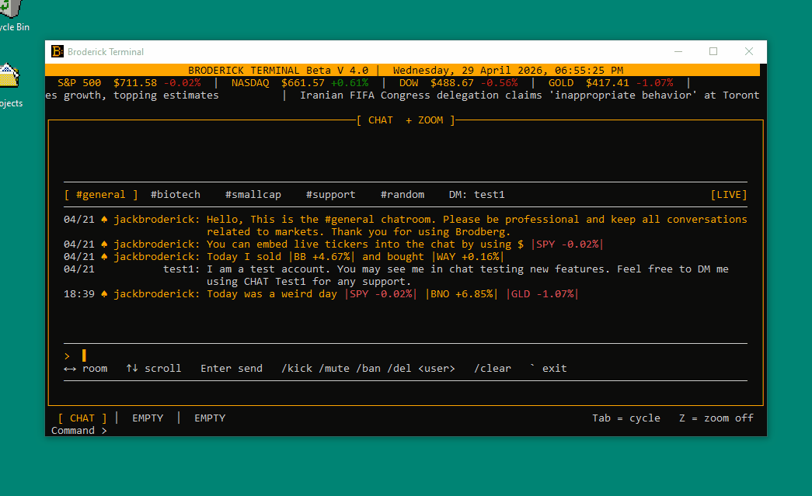
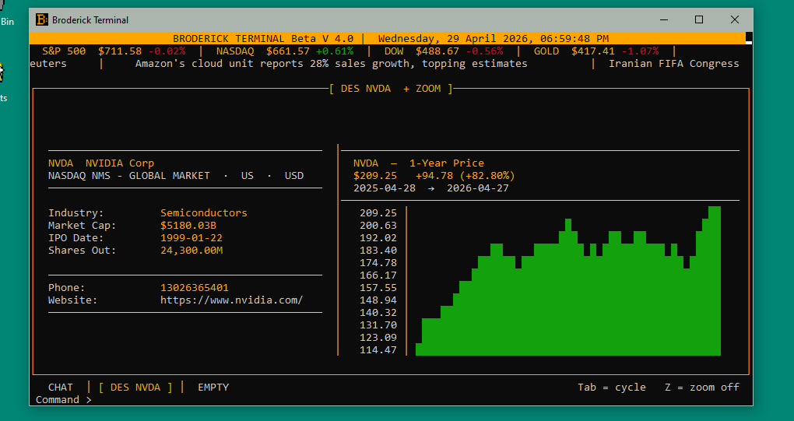
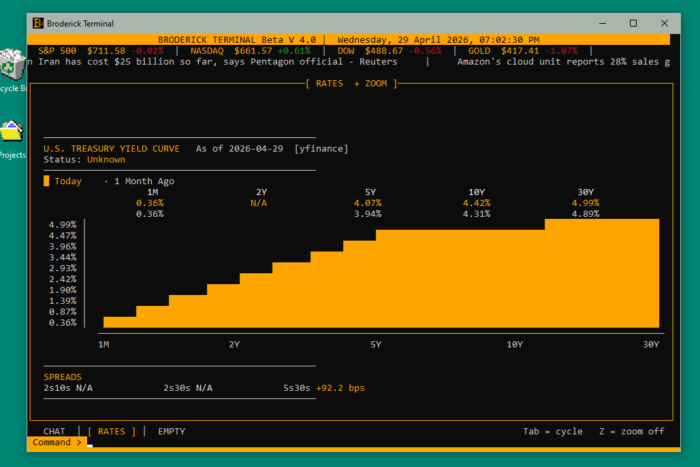
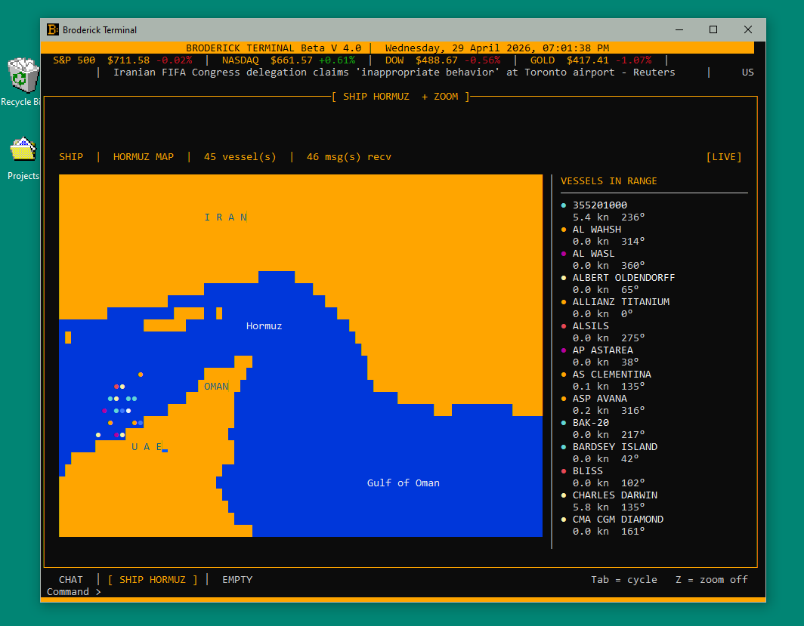
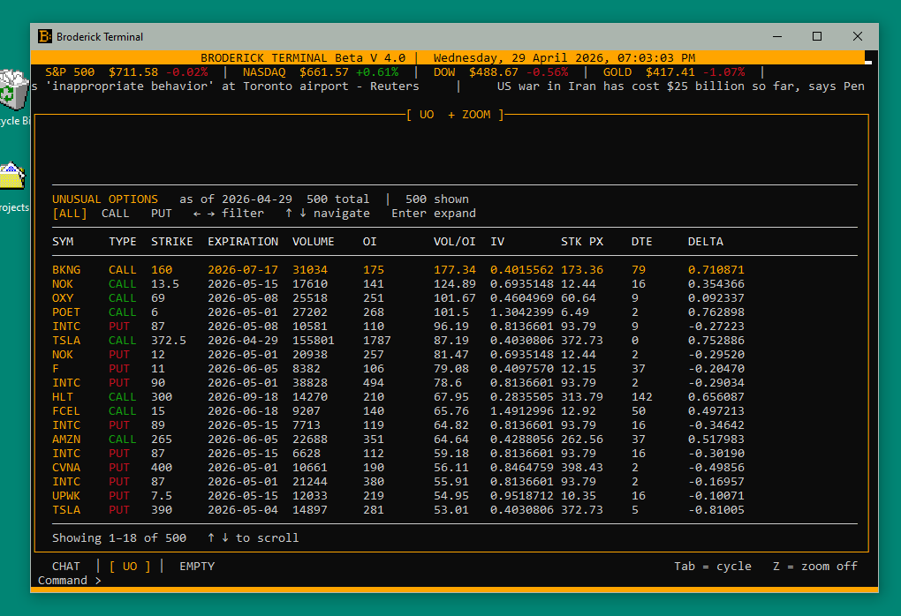

# Broderick Terminal

> A Bloomberg-style financial terminal for the command line — built in Python.


---



> *No Bloomberg subscription required.*

---

## Overview

Broderick Terminal is a full-featured financial terminal that runs directly in your shell. It pulls live market data, renders price charts, tracks real ships at sea, and supports multi-user online accounts — all from a curses-based UI that looks and feels like a professional trading terminal.

All market data is proxied through a central server. **Users never need API keys.** Just run the app and start trading data.

---

## Features

| Category | Feature |
|---|---|
| **Equities** | Live quotes, price charts with timeframes, company profiles, earnings, dividends, peer analysis, executive compensation |
| **Macro** | U.S. Treasury yield curve, FX major/EM pairs vs USD, commodities dashboard (energy, metals, grains) |
| **Shipping** | Live AIS vessel tracking at the Strait of Hormuz via WebSocket stream |
| **Options** | Unusual options activity, open interest monitor |
| **Accounts** | Register, login, public profiles — JWT-authenticated via FastAPI backend |
| **UI** | Multi-pane layout (up to 3 panes), input mode / pane navigation mode, zoom |

---

## Screenshots

| Company Profile | Yield Curve |
|---|---|
|  |  |

| Ship Tracker | Unusual Options |
|---|---|
|  |  |

---

## Quick Start

### Run from source

```bash
git clone https://github.com/JackBroderick/brodberg.git
cd brodberg
pip install -r requirements.txt
python main.py
```

> Requires Python 3.11+. On Windows, `windows-curses` is installed automatically via requirements.

### Build a standalone `.exe` (Windows)

```bash
pyinstaller --onefile \
  --icon=broderick_icon.ico \
  --add-data "data;data" \
  --add-data "docs;docs" \
  --add-data "broderick_icon.ico;." \
  --name "Broderick Terminal" \
  main.py
```

The compiled binary lives at `dist/Broderick Terminal.exe` — runs on any Windows machine with no Python install.

---

## Commands

### Navigation

```
`  (backtick)     Toggle INPUT mode / PANE mode

INPUT mode        All keystrokes go to the command bar
PANE mode         Z=zoom  Tab=cycle pane  ← →=switch tab/timeframe  ↑ ↓=scroll
```

### Equity

| Command | Description |
|---|---|
| `Q <TICKER>` | Live quote with key stats |
| `GIP <TICKER> [1W\|1M\|3M\|YTD\|1Y]` | Price chart (default: 1Y) |
| `DES <TICKER>` | Company description and profile |
| `FA <TICKER> [IS\|BS\|CF] [ANNUAL]` | Financial statements — Income / Balance Sheet / Cash Flow |
| `PEERS <TICKER>` | Competitor peer group |
| `EXEC <TICKER>` | Executive team and board compensation |
| `EARN <TICKER>` | Earnings history and estimates |
| `DIV <TICKER>` | Dividend history |
| `OWN <TICKER>` | Institutional ownership |
| `SENT <TICKER>` | Analyst sentiment and price targets |
| `IPO` | IPO calendar (past 30d + next 90d) |

### Macro & Alternatives

| Command | Description |
|---|---|
| `RATES` | U.S. Treasury yield curve |
| `COMD` | Commodities dashboard — Energy, Metals, Grains |
| `FX [G10\|EM]` | FX major pairs vs USD |

### Options

| Command | Description |
|---|---|
| `OMON <TICKER>` | Open interest monitor |
| `UO` | Unusual options activity |

### AIS Tracking

| Command | Description |
|---|---|
| `SHIP HORMUZ` | Live vessel positions at the Strait of Hormuz |

### Account

| Command | Description |
|---|---|
| `REGISTER <user> <pass>` | Create an account |
| `LOGIN <user> <pass>` | Sign in |
| `LOGOUT` | Sign out |
| `PROFILE` | View your own profile |
| `PROFILE <user>` | View another user's public profile |

### General

| Command | Description |
|---|---|
| `HELP` | In-terminal command reference |
| `CL` | Version changelog |
| `CLEAR` | Clear the active pane |
| `EXIT` | Quit |

---

## Architecture

```
Broderick Client (.exe or python main.py)
  ├── commands/            One file per command (fetch + render + on_keypress)
  ├── market_data.py       server_get() helper — routes all API calls to server
  ├── broderick_session.py ~/.broderick/session.json — token + server URL
  └── ship_data.py         WebSocket client for live AIS feed

Broderick Server (FastAPI + PostgreSQL)
  ├── POST /register  POST /login  GET /me  PUT /me
  ├── GET  /profile/{username}
  ├── GET  /api/quote/{symbol}        Finnhub stock quote
  ├── GET  /api/news                  Finnhub market news
  ├── GET  /api/company/{symbol}      Finnhub company profile
  ├── GET  /api/yield-curve           US Treasury curve
  ├── GET  /api/forex/rates           FX spot rates
  ├── GET  /api/forex/candles         FX OHLC candles
  ├── GET  /api/live/benchmarks       Real-time benchmark prices
  └── WS   /api/ship                  AISStream WebSocket proxy
```

The server holds all API keys. The client holds none. Anyone can run the client and hit the live server, or [self-host their own instance](#self-hosting).

---

## Tech Stack

**Client**
- Python 3.11 + `curses` / `windows-curses`
- `requests`, `websockets`, `yfinance`
- PyInstaller (standalone binary)

**Server**
- FastAPI + Uvicorn
- PostgreSQL (Render managed) or SQLite (local dev)
- `httpx` for async API proxying
- Custom JWT (no third-party auth library)
- Deployed on [Render](https://render.com) Starter tier — always on, no cold starts

**Data Sources**
- [Finnhub](https://finnhub.io) — quotes, news, fundamentals, forex
- [AISStream](https://aisstream.io) — live AIS vessel positions
- yfinance — supplemental equity data

---

## Self-Hosting

Want to run your own Broderick Terminal server? It takes about 10 minutes on Render (free or paid tier).

### 1. Clone and configure

```bash
git clone https://github.com/JackBroderick/brodberg.git
cd brodberg/server
cp .env.example .env
# Edit .env with your keys
```

### 2. Environment variables

| Variable | Required | Description |
|---|---|---|
| `BRODERICK_SECRET` | Yes | Random string used to sign JWT tokens |
| `DATABASE_URL` | Prod | PostgreSQL connection string (set automatically on Render) |
| `FINNHUB_API_KEY` | Yes | Free at [finnhub.io](https://finnhub.io) |
| `AISSTREAM_API_KEY` | Yes | Free at [aisstream.io](https://aisstream.io) |
| `BRODERICK_DB` | Dev only | Path to SQLite file for local development |

### 3. Run locally

```bash
cd server
pip install -r requirements.txt
uvicorn main:app --reload
```

### 4. Deploy to Render

1. Create a new **Web Service** pointing to your fork
2. Set root directory to `server/`
3. Build command: `pip install -r requirements.txt`
4. Start command: `uvicorn main:app --host 0.0.0.0 --port $PORT`
5. Add the environment variables above
6. Attach a **PostgreSQL** database (linked automatically as `DATABASE_URL`)

### 5. Point the client at your server

On first run, or any time:

```
SERVER <your-render-url>
```

The URL is saved to `~/.broderick/session.json` and used for all subsequent requests.

---

## Project Structure

```
brodberg/
├── main.py                   Entry point — curses loop, input handling, pane manager
├── market_data.py            server_get() + benchmark/news background threads
├── broderick_session.py      Session management (~/.broderick/session.json)
├── chart.py                  ASCII price chart renderer
├── ship_data.py              AIS WebSocket client
├── requirements.txt          Client dependencies
│
├── server/
│   ├── main.py               FastAPI app — accounts + API proxy
│   ├── requirements.txt      Server dependencies
│   └── .env.example          Environment variable template
│
├── commands/
│   ├── registry.py           Command router
│   ├── cmd_quote.py          Q
│   ├── cmd_gip.py            GIP
│   ├── cmd_des.py            DES
│   ├── cmd_fa.py             FA
│   ├── cmd_rates.py          RATES
│   ├── cmd_comd.py           COMD
│   ├── cmd_fx.py             FX
│   ├── cmd_ship.py           SHIP
│   ├── cmd_omon.py           OMON
│   ├── cmd_uo.py             UO
│   ├── cmd_peers.py          PEERS
│   ├── cmd_exec.py           EXEC
│   ├── cmd_earn.py           EARN
│   ├── cmd_div.py            DIV
│   ├── cmd_own.py            OWN
│   ├── cmd_sent.py           SENT
│   ├── cmd_ipo.py            IPO
│   ├── cmd_watch.py          WATCH
│   ├── cmd_rev.py            REV
│   ├── cmd_user.py           USER
│   └── cmd_auth.py           REGISTER LOGIN LOGOUT PROFILE
│
├── data/
│   └── hormuz.txt            Strait of Hormuz ASCII map
├── docs/
│   ├── HelpMenu.txt          In-terminal help text
│   └── ChangeLog.txt         Version history
└── ui/
    ├── colors.py             Color pair definitions
    ├── chrome.py             Header, footer, and pane chrome
    └── loading.py            Loading animation
```

---

## Adding a Command

Commands follow a simple three-function pattern:

```python
# commands/cmd_mycommand.py

def fetch(parts: list) -> dict:
    """Called once when the user presses Enter. Return a dict that becomes `cache`."""
    data = market_data.server_get("/api/some-endpoint")
    return {"data": data}

def render(stdscr, cache: dict, colors: dict) -> None:
    """Called every frame. Draw to stdscr using cache."""
    stdscr.addstr(0, 0, str(cache.get("data", "")))

def on_keypress(key: int, cache: dict) -> dict:
    """Optional. Handle arrow keys / Enter for navigation. Return updated cache."""
    return cache
```

Register it in `commands/registry.py` and add a help line to `docs/HelpMenu.txt`.

---

## License

MIT — see [LICENSE](LICENSE)

---

*Built by [Jack Broderick](https://github.com/JackBroderick)*
